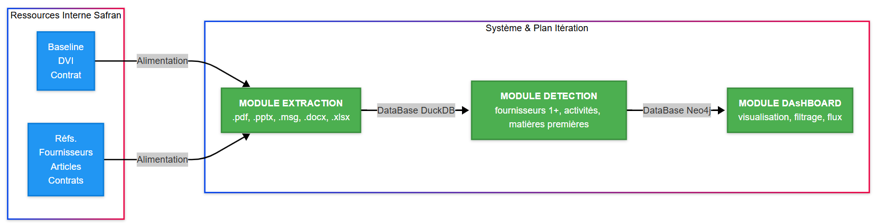

# ETIS For Safran

**Projet de R&D en intelligence artificielle pour la résilience de la supply chain.**

Un projet de recherche et développement en intelligence artificielle visant à améliorer la connaissance et la gestion de la supply chain Safran par cartographie et prédiction des risques. Il est porté par le laboratoire ETIS (UMR 8051) de l'Université de Cergy-Pontoise, et Safran Aircraft Engines.

 

L'architecture complète du projet est disponible dans le [wiki/architecture](https://github.com/etisFORsafran/wiki/architecture/cahier-architecture.html)

 

# 🚀 PARTIE I

  

- [injestion](https://github.com/etisFORsafran/injestion) — Ingestion des données de la supply chain
- [extraction](https://github.com/etisFORsafran/extraction) — Extraction des données de la supply chain
- [detection](https://github.com/etisFORsafran/detection) — Détection et structuration des entités métier
- [visualisation](https://github.com/etisFORsafran/visualisation) — Visualisation des données de la supply chain

 

# 🤖 PARTIE II

 

